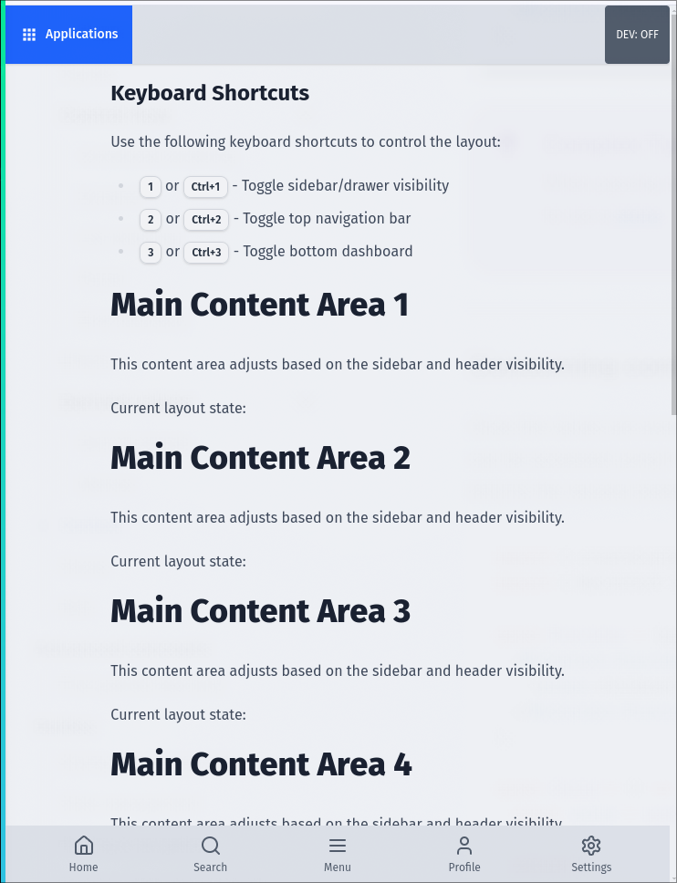
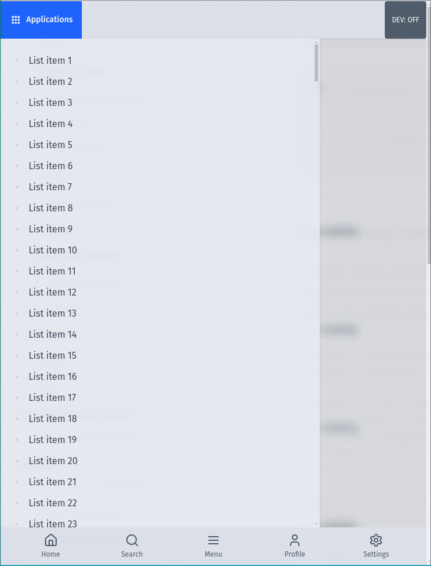
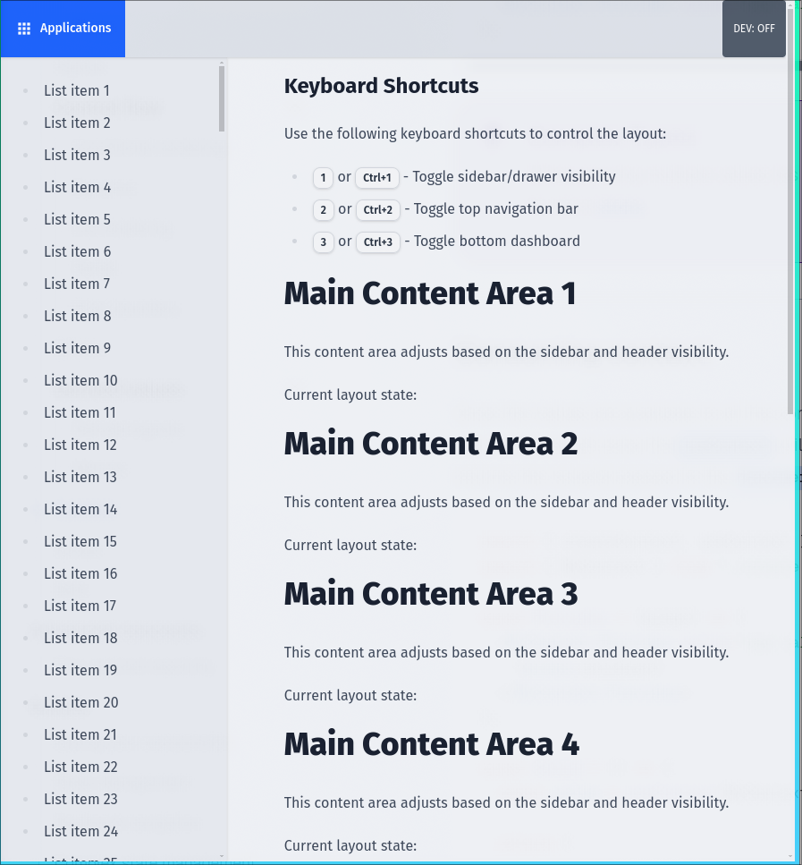
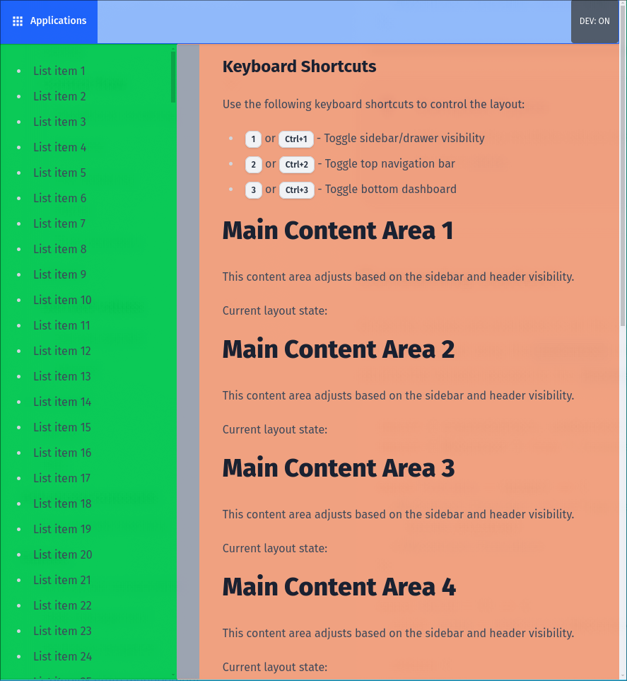

# Solid Js Sidebar Layout

This is a layout with a sidebar on the left, navbar on top and dash on the bottom.

It uses JS to toggle the css variables, this may change later.

<html>

    
    
    
    

</html>
